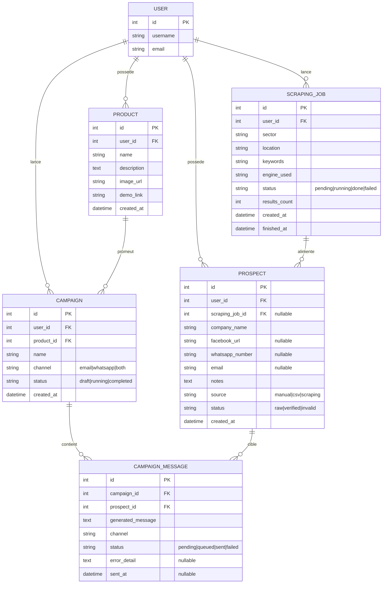

# Phase 3 — Plateforme de Prospection Guidée
## Architecture globale & modèle de données

## 1. Principes directeurs

On garde la même Clean Architecture / SOLID que les phases 1 & 2 : les routes ne
contiennent aucune logique métier, les services ne connaissent aucun détail
d'implémentation externe (scraping, IA, envoi), et tout passe par des
interfaces injectées via `container.py`. Ça permet de changer de moteur de
scraping ou de fournisseur IA en une ligne, sans toucher au reste du code.

```
Route (Flask blueprint)
   -> Service (orchestration, une seule responsabilité)
        -> Interface (contrat abstrait, SRP + ISP)
             -> Implémentation concrète (Puppeteer, Gemini, SMTP...)
        -> Repository (accès SQLAlchemy, aucune logique métier)
             -> Modèle (ORM)
```

Aucune route n'appelle jamais directement Puppeteer, Gemini ou un client SMTP :
elle passe toujours par un service, qui passe toujours par une interface.

## 2. Arborescence proposée

```
app/
├── models/                      # Entités SQLAlchemy (section 4)
│   ├── prospect.py
│   ├── product.py
│   ├── scraping_job.py
│   ├── campaign.py
│   └── campaign_message.py
│
├── interfaces/                  # Contrats abstraits (DIP)
│   ├── prospect_repository_interface.py
│   ├── product_repository_interface.py
│   ├── campaign_repository_interface.py
│   ├── scraper_engine_interface.py      # IScraperEngine
│   ├── ai_provider_interface.py         # IAIMessageGenerator
│   ├── channel_sender_interface.py      # IChannelSender
│   └── contact_validator_interface.py   # IContactValidator
│
├── repositories/                # Implémentations SQLAlchemy des repos
│   ├── sqlalchemy_prospect_repository.py
│   ├── sqlalchemy_product_repository.py
│   └── sqlalchemy_campaign_repository.py
│
├── integrations/                # Adaptateurs vers le monde extérieur
│   ├── scrapers/
│   │   ├── playwright_scraper.py
│   │   ├── selenium_scraper.py
│   │   └── bs4_scraper.py
│   ├── ai_providers/
│   │   ├── gemini_provider.py
│   │   ├── groq_provider.py
│   │   ├── mistral_provider.py
│   │   ├── ollama_provider.py
│   │   └── huggingface_provider.py
│   └── channels/
│       ├── email_sender.py
│       └── whatsapp_sender.py
│
├── services/                    # Logique métier, une responsabilité chacun
│   ├── prospect_service.py      # CRUD + import CSV + dedup
│   ├── product_service.py       # CRUD catalogue produit
│   ├── scraping_service.py      # orchestre IScraperEngine + nettoyage
│   ├── ai_generation_service.py # construit le prompt, appelle IAIMessageGenerator
│   └── campaign_service.py      # orchestre l'envoi + le reporting
│
├── validators/
│   └── contact_validator.py     # email / numero WhatsApp (E.164)
│
├── routes/                      # Presentation layer (blueprints Flask)
│   ├── prospect_routes.py
│   ├── product_routes.py
│   ├── scraping_routes.py
│   └── campaign_routes.py
│
├── forms/                       # Flask-WTF
├── container.py                 # Composition root (DI)
├── config.py
└── extensions.py
```

## 3. Où s'applique chaque principe SOLID

| Principe | Application concrète dans ce projet |
|---|---|
| **S**RP | `ScrapingService` orchestre uniquement le scraping+nettoyage ; l'envoi des messages est dans `CampaignService` ; la génération IA dans `AIGenerationService`. Aucun service ne fait deux métiers. |
| **O**CP | Ajouter Scrapy comme 4e moteur de scraping, ou OpenAI comme 6e fournisseur IA = une nouvelle classe qui implémente l'interface, **zéro ligne modifiée** ailleurs. |
| **L**SP | Toute implémentation de `IScraperEngine` retourne le même DTO `ScrapedProspect` ; toute implémentation de `IAIMessageGenerator` retourne le même DTO `GeneratedMessage`. Le service appelant n'a jamais besoin de savoir laquelle est active. |
| **I**SP | Interfaces étroites et séparées (`IScraperEngine`, `IAIMessageGenerator`, `IChannelSender`, `IContactValidator`) plutôt qu'une interface fourre-tout `IExternalService`. |
| **D**IP | Les services dépendent des interfaces, jamais des SDK (`google-generativeai`, `groq`, `playwright`...) directement. `container.py` est le seul endroit qui connaît les classes concrètes. |

## 4. Modèle de données



### Notes sur le modèle

- **`Prospect.status`** distingue les données brutes (`raw`, tout juste
  scrapées/importées) des données passées au tamis de vérification
  (`verified`/`invalid`) — c'est le pivot de l'étape "Nettoyage &
  Vérification" du cahier des charges.
- **`Prospect.scraping_job_id`** est nullable : un prospect saisi
  manuellement ou importé par CSV n'a pas de job associé.
- **Contrainte d'unicité** recommandée : `(user_id, email)` et
  `(user_id, whatsapp_number)` sur `Prospect`, pour que le dédoublonnage
  (mentionné dans le cahier des charges) soit garanti au niveau base de
  données et pas seulement en Python.
- **`CampaignMessage`** est la table pivot Campagne↔Prospect : c'est elle
  qui porte le message généré par l'IA *pour ce prospect précis* et son
  statut d'envoi individuel — c'est ce qui alimente le tableau de bord
  temps réel (envoyés/échecs/en attente = un `GROUP BY status` sur cette
  table).
- Contrainte d'unicité `(campaign_id, prospect_id)` pour ne jamais
  envoyer deux fois le même message au même prospect dans la même
  campagne.

## 5. Point d'architecture à trancher : exécution asynchrone

Le scraping, les appels IA et l'envoi en masse sont des opérations
**longues** (plusieurs secondes à plusieurs minutes). Flask en mode
synchrone ne peut pas bloquer une requête HTTP pendant ce temps sans
geler l'interface. Deux options, à choisir avant de coder `ScrapingService`
et `CampaignService` :

| Option | Avantages | Inconvénients |
|---|---|---|
| **Thread / `APScheduler` en arrière-plan** (statut persisté en base, dashboard qui poll en AJAX toutes les X secondes — le pattern déjà utilisé dans le coffre-fort) | Simple, pas de dépendance infra supplémentaire, cohérent avec l'existant | Ne scale pas au-delà d'un seul process ; pas de retry robuste |
| **Celery + Redis** (file de tâches dédiée) | Scalable, retry automatique, standard pour ce type de charge | Ajoute une dépendance infra (Redis) à faire tourner et déployer |

Recommandation pour un projet de cette taille : commencer avec l'option 1
(thread + statut en base + polling AJAX), qui suffit largement à valider
les critères de "Definition of Done", et documenter Celery comme
évolution possible dans `SECURITY.md`/`README.md` si le volume augmente.

## 6. Prochaines étapes suggérées

1. Créer les modèles SQLAlchemy + migration Alembic baseline (section 4).
2. `ProspectService` + `ProductService` (CRUD + import CSV) — brique la
   plus simple, valide toute la chaîne route→service→repository avant
   d'attaquer les intégrations externes.
3. `IScraperEngine` + une première implémentation (Playwright recommandé :
   plus stable que Selenium, plus simple à containeriser que Puppeteer/Node
   depuis un backend Python).
4. `IAIMessageGenerator` + un premier provider (Groq ou Gemini, tier
   gratuit généreux).
5. `IChannelSender` (Email d'abord, plus simple à tester que WhatsApp) +
   `CampaignService`.
